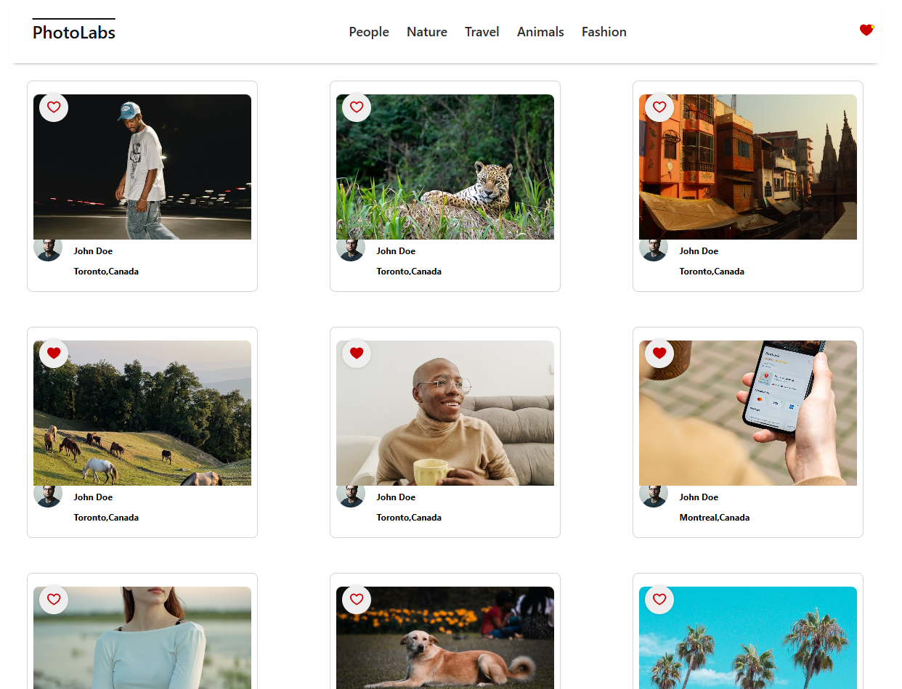
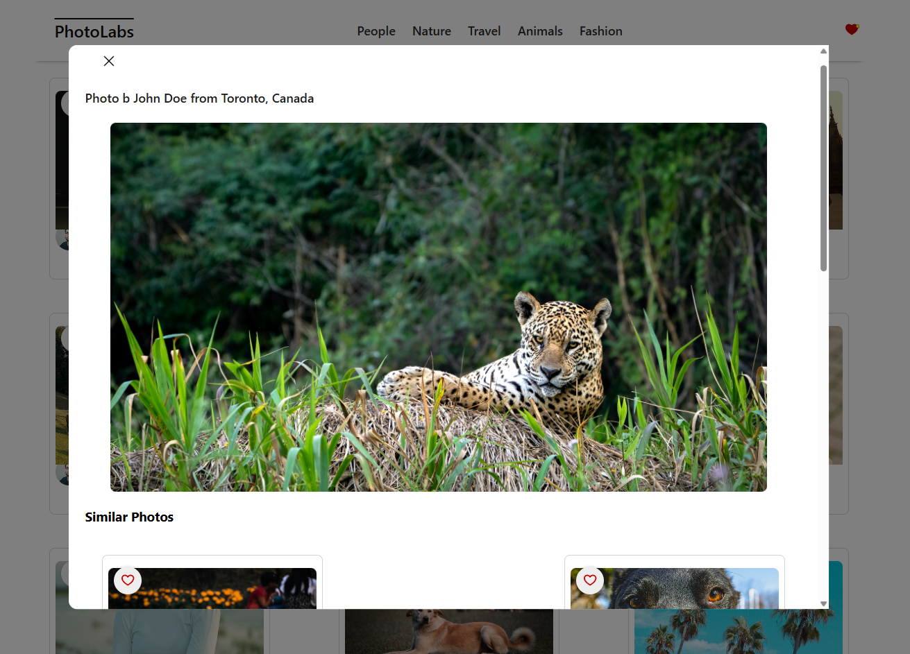
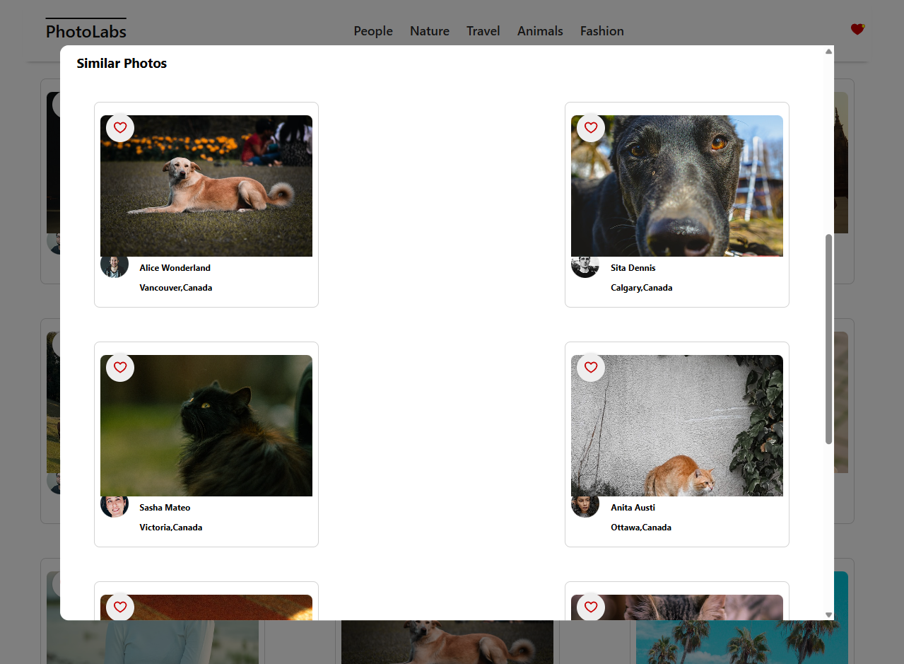

# PhotoLabs React Application

A responsive single-page photo gallery built with React. Users can browse and favourite photos,
filter them by topic, and select photos to view in a larger format, and then select others
from a list of similar-topic photos. Designed to be simple and sleek, I hope you enjoy.

This project was built as part of a React development module using Vite, SCSS, and custom React hooks.


## Tech Stack

- React 18
- React Testing Library
- Vite
- SCSS (Sass)
- Jest
- ESLint


## Setup

Install dependencies with `npm install`.
Note: This project requires at least Node v16


## Available Scripts

In the project directory, you can run:

```sh
npm run dev       # Starts the development server at http://localhost:3000
npm run lint      # Runs ESLint to check for code quality issues
npm run test      # Runs the test suite using Jest
```


## Screenshots



